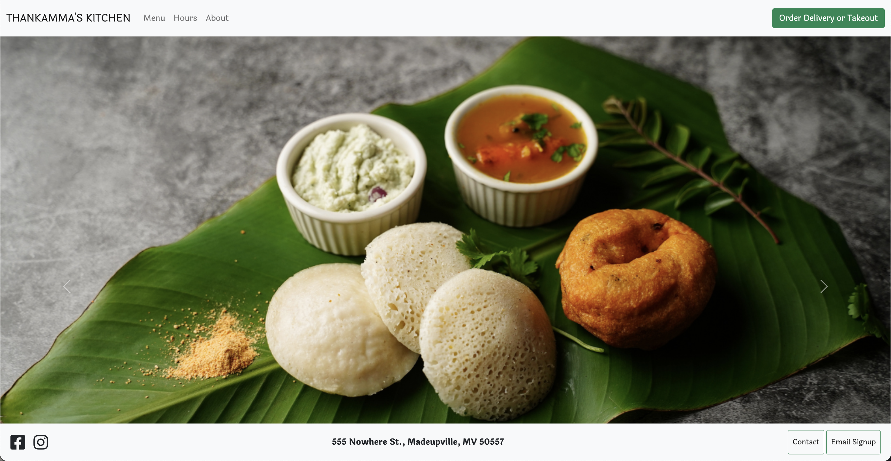
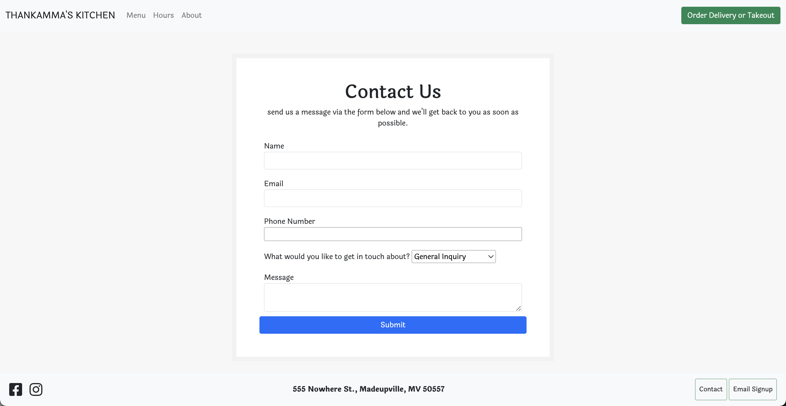
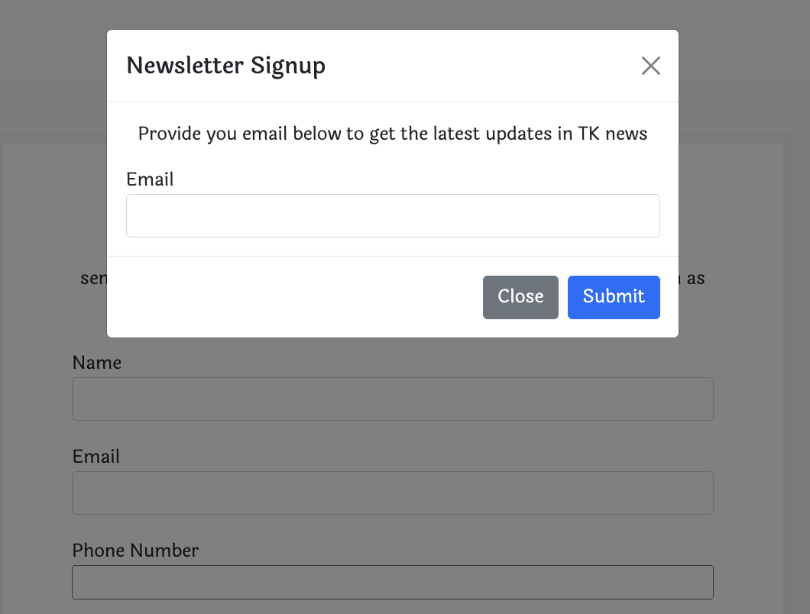

# THANKAMMA'S KITCHEN

 

  )
  
  ## Description

 Thankamma's Kitchen is a fictional restaurant  multi-page website using HTML, CSS, jQuery and Bootstrap.

[Deployed application](https://jessvarghese.github.io/Thankammas-Kitchen/)

  ## Table of Contents

  * [Installation](#Installation)
  * [Visuals](#usage)
  * [License](#license)
  * [Technologies](#technologies)
  * [Questions](#questions)
 

  ## Installation
  gh repo clone JessVarghese/Thankammas-Kitchen
  

 ## Visuals

 
 
 

  ## License
  This project operates under the [MIT](https://choosealicense.com/licenses/MIT/) license.

  ## Technologies
 * HTML
 * CSS
 * JQuery
 * Bootstrap

## Questions
  If you have any questions about the repo, open and issue:
  * Github: https://github.com/JessVarghese/Thankammas-Kitchen
